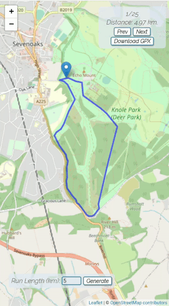

# RoutePlanner Backend
This repository contains code that powers the [routeplanner app](https://yurachistic1.github.io/routeplanner-frontend/). The app suggests circular walks or runs based on start location and desired distance. 

##  Motivation
I have been interested in making an app like that for a while since I started running more frequently. I normally use google maps and add multiple destinations to work out a distance of a potential run, but that is rather cumbersome way of doing it. Secondly I thought it would be a good challenge since I would have to figure out how to get suitable map data and then design an algorithm that would produce decent quality circular paths. 

## Implementation
This service is designed to be used as serverless function hosted on google cloud platform with an API gateway to it. 

Map data is retrieved from a public OSM server and this is also the slowest step in the process as it can take a few seconds to download the data. The data is then parsed and routes are calculated. Best 25 results are returned encoded as JSON. 
 
## Result 
The quality of routes does vary a lot. Some areas especially urban areas with a lot of suitable roads and paths can produce great results. Other times the routes might be hard to navigate due to large number of turns or the fact that they keep going back on themselves. This variability was the main reason to return best 25 as it makes it more likely that some of the suggestions are suitable. 

Example of good suggestions:

Back in high school I took part in the Knole run which is a 10km cross country run made up of two loops.

Last thing to note is while I tried to eliminate the possibility of roads and paths that are not suitable for pedestrians being used, they still will likely appear sometimes as OSM data is not always complete or up to date in different parts of the world.  